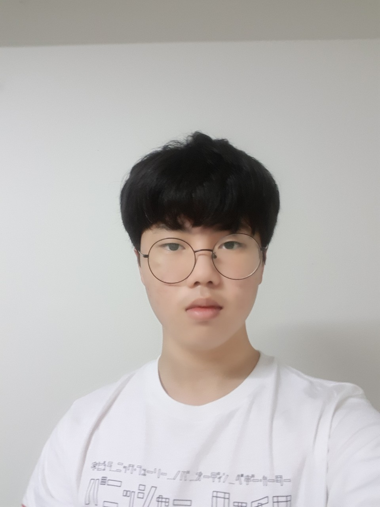

# ACPU1
<html>

<head>

</head>

<body>

  <h1>서승호's fan page'</h1>

  

  <h2>서승호 그는 누구인가?</h2>

<ol>서승호은 2003년 10월 31일 대한민국에서 태어나 현재 베트남 호치민시에 살고 있다고 합니다.</ol>

<ol>그는 어렸을때 부터 컴퓨터에 관심이 많아서 이 분야에 대해 공부를 하다가 마침 학교에 컴퓨터 동아리에 있어서 들어오게 되었다.</ol>

<ol>출생: 2003년 10월 31일 (17세)</ol>

<ol>신체: 168cm</ol>

<ol>국적: 대한민국</ol>

<ol>취미: 학문적 고찰 및 미래에 대한 예상</ol>

<ol>꿈: 미국대통령, 돈 많은 백수</ol>

<ol>좋아하는 음식: 고기 특히 스테이크</ol>

<ol>좋아하는 동물: 소(이유 : 맛이 있기 때문)</ol>

<ol>좋아하는 색깔: 보라색</ol>

<ol>좋아하는 노래: 해피나루</ol>

<ol>버킷리스트:

  <ol>1) 건물사기</ol>

<ol>  2) 버스 탈때 머리 부딪혀보기</ol>

<ol>  3) 이성에게 번호따여보기</ol>

<ol>  4) 12시 넘어 집 들어가보기</ol>

<ol>  5) 유유럽가보기</ol>

  </oi>

<ol> 너에 대한 한줄평: 예의바름</ol>

  

</body>

</html>
